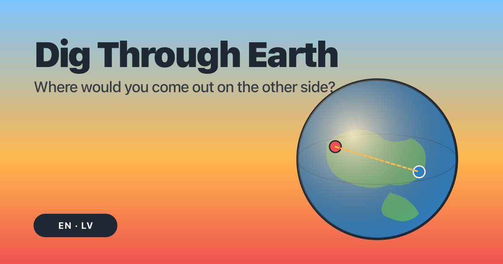

# 🌍 Dig Through Earth

> Where would you come out if you dug straight through the Earth? An interactive antipode explorer for kids.

**Live: https://mreppo.github.io/dig-through-earth/**

[](https://github.com/mreppo/dig-through-earth/deployments/github-pages)
[](https://github.com/mreppo/dig-through-earth/actions/workflows/i18n-check.yml)



## What it does

- Type your coordinates or tap "Use my location" - the app reverse-geocodes both your spot **and** its antipode (the exact opposite side of Earth).
- Two views you can flip between:
 - **2D map** (Leaflet + OpenStreetMap) - twin maps side-by-side: click the left one to drop a pin.
 - **3D globe** (globe.gl) - points and a dashed arc connect origin to antipode; smooth fly-around camera, slow auto-rotate when idle.
- Shows the straight-through-Earth distance (~12,742 km) **and** the surface distance, with friendly fun-facts (97% of European antipodes land in the ocean!).
- **Bilingual EN/LV** - every string is in `i18n/en.json` + `i18n/lv.json`. The Latvian is kid-friendly, informal `tu`, written for ages 7-12.
- **Geography quiz** - 10 random questions per session, drawn from a pool of 200 covering continents, oceans, mountains, antipodes, weather, Earth science, animals, and time / seasons. Immediate ✓ / ✗ feedback and a tiered end-screen message. Replaying picks a fresh random 10.

## Tech stack (what actually shipped)

- **Plain HTML / CSS / ES modules** - no build step, no bundler, no npm.
- **Leaflet 1.9.4** ([unpkg, SRI-pinned](https://unpkg.com/leaflet@1.9.4)) for the 2D maps + OpenStreetMap tiles.
- **globe.gl 2.46.1** ([unpkg, SRI-pinned](https://unpkg.com/globe.gl@2.46.1), three.js bundled) for the 3D globe - **lazy-loaded** on first 3D toggle so 2D-only visitors never pay the ~1.8 MB cost.
- **Nominatim** for reverse geocoding (free public endpoint, 1 req/sec rate-limited locally, in-memory cache by rounded coords).
- **Hosted on GitHub Pages** - the `main` branch root is the public site.

No tracking, no analytics, no third-party fonts. Kids' site - privacy matters.

## Local development

```bash
python3 -m http.server 8000
# Then visit http://localhost:8000
```

That's the whole build. Edit any `.html` / `.css` / `.js` file and reload.

### Running the tests

```bash
python3 -m http.server 8000
# Open http://localhost:8000/tests/antipode.test.html
```

The page runs vanilla JS assertions in the browser and renders a green / red summary.

### Checking i18n parity

```bash
python3 scripts/check-i18n.py
# → i18n parity OK (130 keys)
```

CI also runs this on every PR via `.github/workflows/i18n-check.yml`.

### Validating the quiz pool

```bash
python3 scripts/check-questions.py
# → questions.json OK (200 questions, correctIndex distribution: {0: 50, 1: 50, 2: 50, 3: 50})
```

CI runs this on every PR via `.github/workflows/questions-check.yml`.

### Adding quiz questions

Quiz items live in `data/questions.json` as a flat array. Each entry looks like:

```json
{
  "id": "kebab-case-unique",
  "topic": "continents",
  "correctIndex": 2,
  "en": { "text": "...", "options": ["a", "b", "c", "d"] },
  "lv": { "text": "...", "options": ["a", "b", "c", "d"] }
}
```

Rules:

- `id` is kebab-case, unique across the pool.
- `correctIndex` is `0`-`3`. Try to keep the overall distribution balanced (`check-questions.py` enforces 40-60 per slot).
- Both `en.options` and `lv.options` must have exactly 4 strings, positionally aligned with `correctIndex`.
- LV strings must follow `latvian-kids-translator` rules: informal `tu`, proper diacritics, ASCII hyphens only, age-7-12 reading level.
- The quiz draws a fresh random 10 per session, so don't worry about ordering.

## Contributing - adding more languages

The i18n engine in `js/i18n.js` is locale-agnostic; adding a new language is mostly translation work.

1. **Copy the file:** `cp i18n/en.json i18n/<locale>.json`. Use the ISO 639-1 code (e.g. `de`, `fr`, `pl`, `et`).
2. **Update the `_meta` block** at the top:
   ```json
   "_meta": {
     "languageName": "Deutsch",
     "direction": "ltr",
     "locale": "de"
   }
   ```
   The `_meta` block is skipped by the parity check (it's expected to differ per language).
3. **Translate every value** in place. Keep the JSON structure identical to `en.json` - the parity script enforces it. **Do not change keys, only values.**
4. **Preserve `{{name}}` placeholders exactly** (`{{lat}}`, `{{lng}}`, `{{km}}`, `{{current}}`, `{{total}}`, `{{answer}}`, `{{correct}}`).
5. **Quiz questions live in `data/questions.json`, not in i18n files.** Each question carries its EN and LV variants inline plus the `correctIndex`. See "Adding quiz questions" below. The i18n files only hold UI chrome (progress label, feedback, end-screen tiers).
6. **Add the language to the toggle.** In `index.html`, add a new `<button type="button" class="toggle__btn" data-lang="<locale>">…` next to the existing EN / LV buttons. Add corresponding `lang.<locale>` keys in every `i18n/*.json`.
7. **Verify:** `python3 scripts/check-i18n.py` must report parity OK. Reload the page, switch to the new locale, walk through the locator + 2D + 3D + quiz to confirm no string falls back to the raw key.

### Key naming convention

- Hierarchical, dot-separated: `header.title`, `results.distanceThrough`, `quiz.progress`. (Quiz question bodies live in `data/questions.json`, not in i18n.)
- All user-visible strings use `data-i18n="key"` on the HTML element, or `t('key', params?)` in JS.
- No hardcoded user-facing strings in `index.html`, `404.html`, or any `js/*.js`.
- Top-level keys starting with `_` (currently just `_meta`) are excluded from the parity check.

### Latvian style

The `latvian-kids-translator` sub-agent owns LV tone. Hard rules: informal `tu` (never `Jūs`), proper diacritics, no em-dashes (EU style - ASCII hyphen `-`), gender-neutral by default. See `.claude/agents/latvian-kids-translator.md` for the full brief.

## Performance

- **Lighthouse mobile** on the live URL: Accessibility 100, Best Practices 96, SEO 100.
- **LCP 702 ms** under Slow 4G + 4× CPU throttle (well inside the 2.5 s "good" threshold).
- **CLS 0.00** - no layout shift on load.
- **Initial page weight ~66 KB** (HTML + CSS + ES modules + bundled Leaflet, gzip-on-the-wire). Issue target: < 2 MB excluding map tiles. ✔
- globe.gl + the Earth texture (~2 MB combined) load lazily only on the first 3D toggle.

## Roadmap

The site shipped its v1 in PRs #1-#7. Post-v1:

- [#12](https://github.com/mreppo/dig-through-earth/issues/12) - small race on rapid reverse-geocode requests (out-of-order resolution can render stale data; rate-limit queue mostly hides it).

See [Issues](https://github.com/mreppo/dig-through-earth/issues) for anything else.

## Licence

[MIT](LICENSE) © 2026 Mareks Reppo.
